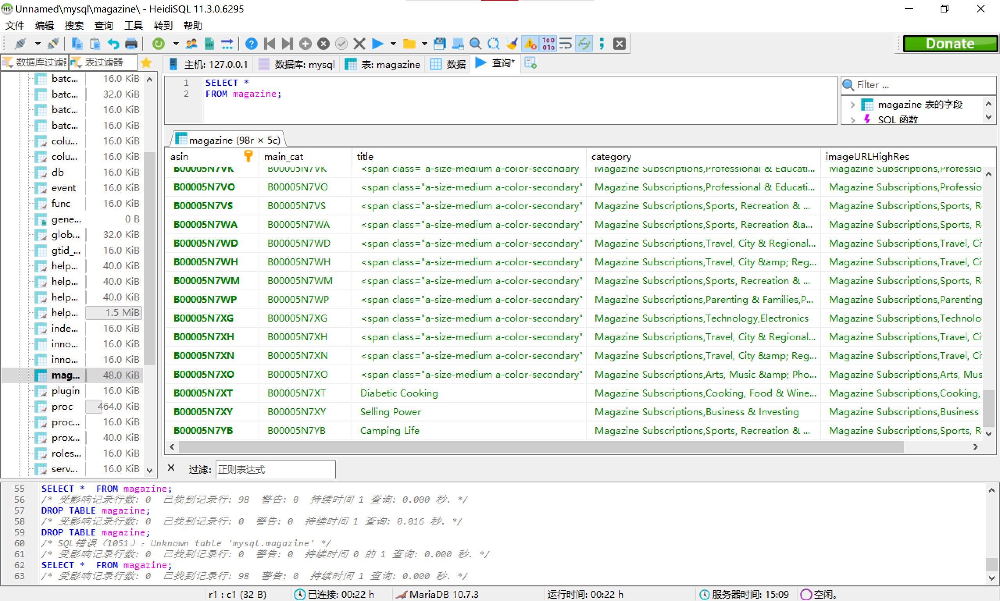

# 测试环境

- 操作系统：ArchLinux
- Java版本：openjdk version "11.0.15" 2022-04-19 LTS
- Maven版本：Apache Maven 3.8.4
- SQL：mysql  Ver 15.1 Distrib 10.7.4-MariaDB, for Linux (x86_64) using readline 5.1
- 开发工具：Visual Studio Code

# 基本批处理和与SQL的整合

使用`JsonReader`类对json文件进行读取，`ProductWriter`类将`Product`类写入到数据库中。

使用`PartitionConfig`类对批处理任务进行设置，考虑到测试机器CPU为8c16t，便将线程池的大小设置为`32`。

最终得到mysql中的查询结果如下：

# 与webpos的整合

参考aw04中的`JD.java`，定义类`AMZ`对接口`PosDB`进行实现。

`getProducts`函数通过JDBC访问数据库，为了效率考虑，执行的mysql语句为加入了`LIMIT 500`。

最终得到webpos的界面如下：

